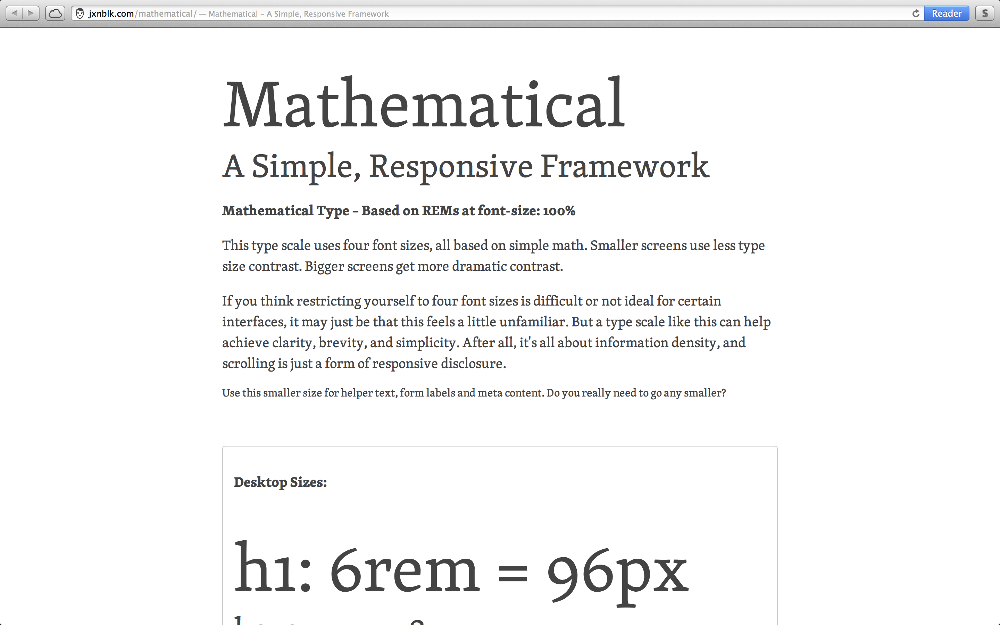

# Mathematical

A simple, responsive web framework.

## Mathematical Type
Highly readable on large and small screens. 
Consider it a series of smart defaults for headers and body copy. 

### Lightweight
Mathematical Type is light-weight. Really light-weight. Uncompressed CSS weighs in at a hefty 920 bytes. 
Minified version is 620 bytes. 

### Browser Support
Mathematical Type uses REMs (root em units) which are supported in all new major browsers except for Opera mini. 

Currently supported by:
* IE9+
* Firefox 3.6+
* Chrome 6.0+
* Safari 5.0+
* iOS Safari 4.0+
* Android browser 2.1+
* Blackberry Browser 7.0+
* Opera Mobile 12.0+
* Chrome for Android 25.0+
* Firefox for Android 19.0+

For more info visit: http://caniuse.com/rem

